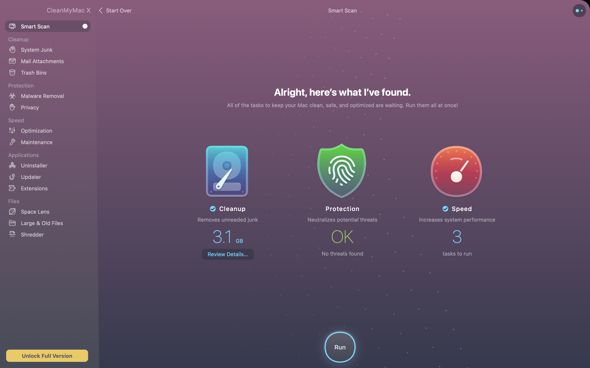

# 10/10 stock tracker

Add stocks to your watchList with the 10/10 stock tracking app. It will give users insight on top 10 daily stock gainers and losers, Allow you to search for any stock in the market, as well as share and connect with a community. 

# installation 

to install all necessary dependencies, open the terminal inside youre root folder and run 'npm i'. 

## Getting Started
run 'npm start' inside your root terminal.

To participate, give your best answers in the questionaire then click 'submit' to get your results

## Built With

* [HTML](https://developer.mozilla.org/en-US/docs/Web/HTML)
* [CSS](https://developer.mozilla.org/en-US/docs/Web/CSS)
* [NodeJs](https://developer.mozilla.org/en-US/docs/Glossary/Node.js)
* [ReactJs](https://developer.mozilla.org/en-US/docs/Learn/Tools_and_testing/Client-side_JavaScript_frameworks/React_getting_started)
* [MySQL](https://www.siteground.com/tutorials/php-mysql/mysql/)
* [Javascript](https://developer.mozilla.org/en-US/docs/Web/JavaScript)

## Deployed Link

* [See Live Site](https://stormy-refuge-75970.herokuapp.com/)

## Authors

Fanuel Alem 

- [Link to Portfolio Site](#)
- [Link to Github](https://github.com/fanuelalem/basic-portfolio-new)
- [Link to LinkedIn](https://www.linkedin.com/in/fanuel-alem-12991b32/)

See also the list of [contributors](https://github.com/your/project/contributors) who participated in this project.

## License

This project is licensed under the MIT License 

## Acknowledgments

* professorHat tip to anyone whose code, libraries, packages, or UI was used  / inspired from
* teacher assistants